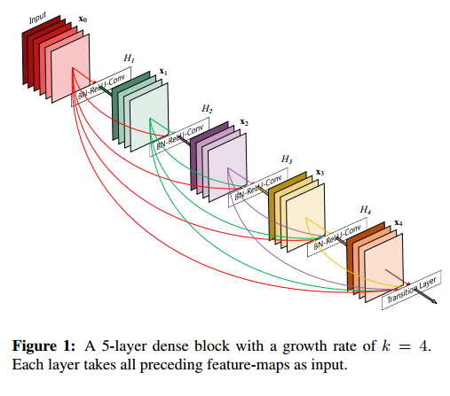
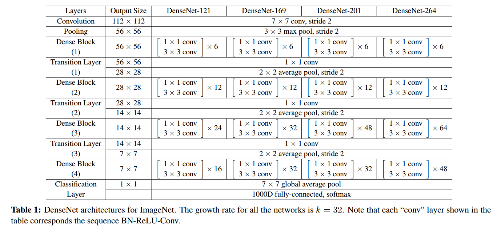
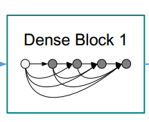
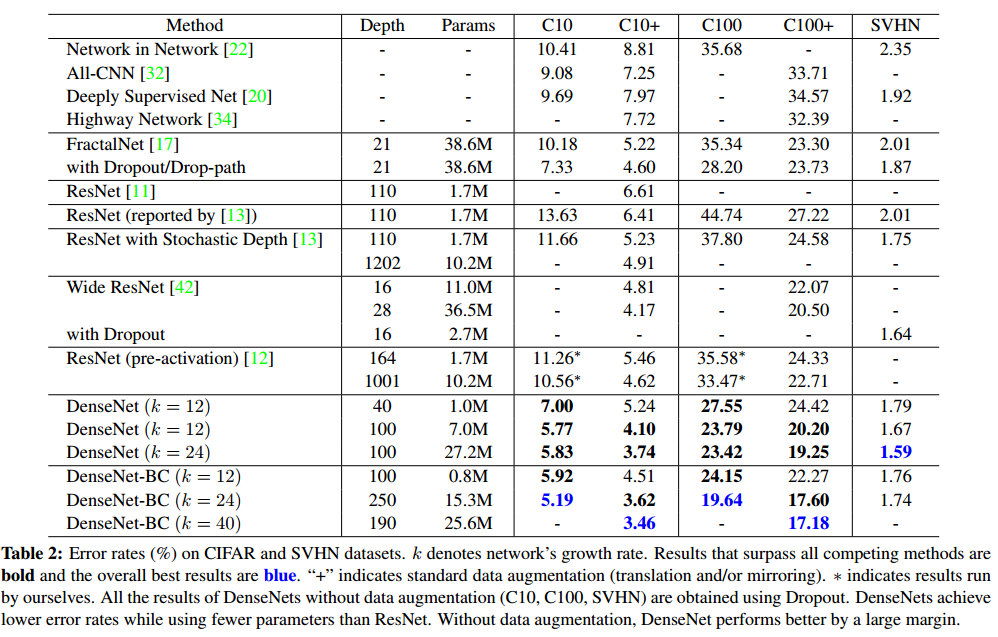
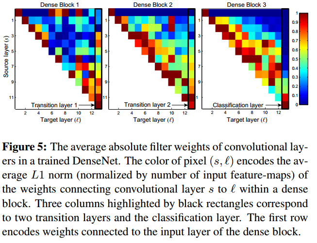

> 论文：[Densely Connected Convolutional Networks](https://arxiv.org/abs/1608.06993)  CVPR 2017 (Best Paper Award) 
> 代码：https://github.com/liuzhuang13/DenseNet 竟然是用lua写的

# 0 简介

这篇文章提出了一种不同于ResNet的深层卷积神经网络，称为DenseNet。

为了在大数据集上获得比较好的效果，主要的做法有两种

- **设计更宽的网络**：代表：GoogLeNet，FractalNets
- **设计更深的网络**：代表：HighwayNet，ResNet

更宽的网络此处不说了，对于更深的网络，因为在训练时存在的梯度消失现象很严重，所以使用直接堆积的方式是不行的。深层卷积神经网络 ResNet 为了解决网络在训练时的梯度消失问题，提出了一种残差模块：

正是这种残差模块中的  shortcut connect  使得深层网络的训练成为可能，解决了深层网络训练过程中的梯度消失问题，ResNet针对于ImageNet的网络最深可以做到152层，而在CIFAR上甚至做到了上千层。

后面很多关于新型模型设计的文章基本都保留或者借鉴了这种类似的 shortcut connect 或者 identity mapping。

而DesNet从另一个角度出发设计出了更深的网络，效果比ResNet好，计算量也更少，这个设计的思想就是 **feature reuse** 。

原文是这样说的：

> Instead of drawing representational power from extremely deep or wide architectures, DenseNets exploit the potential of the network through feature reuse, yielding condensed models that are easy to train and highly parameterefficient.    

**一句话概括：**

这篇文章提出 feature reuse 的思想，即在前向过程中将每一层 $L_i$ 都添加到  $L_i$ 之后的所有层的输入中，形成一种密集的跳层连接，由这种方式构成的网络称为 DenseNet，是一种不同于 ResNet 而又稍优于 ResNet 的新型的基础深度卷积神经网络。

# 1 DenseNet设计思想

DenseNet的设计思想是 **feature reuse** ，也就是特征再利用，怎么个再利用法呢，看下图，一目了然：

这个图很直观明了的展示了DenseNet feature reuse的设计思想。这是一个dense block，是DenseNet中的一个子模块，每一层的输入都包含了前面所有的层（通过concatenate的方式），对于一个L层的dense block，其连接的数量有  $L(L+1) \over 2$  ，正是因为它的密集连接，所以这个网络才会叫做DenseNet。公式2中的 $H_l$ 代表的是一系列操作：BN+ReLU+3 × 3Conv。

很明显由于跳层连接的存在，要求一个dense block中的feature map的尺寸应该相等，因此DenseNet同样也是由不同的block构成的，这些 dense skip connection 也只存在于block内部。网络的整体结构如下：

------

**ResNet的结构** 

ResNet的结构是下图这样的：

假设 前面一层为 $x_{l-1}$ 相邻的后面一层为 $x_l$ ，$H_l$ 代表 BN+ReLU+Conv等一系列操作，那么残差模块：

这个式子中的identity mapping可以使梯度直接传递到前一层，而不用经过block中的两个中间层，相当于减少了网络的层数。这对于避免梯度消失是很有效的。

不过作者认为residual block中的 element wise相加的操作会阻碍信息流，所以作者在后面使用的是 concatenation 操作。

**Dense connectivity.**  

DenseNet 网络中的密集连接可以保证后面层的输入包含前面的所有层

与公式1相比，这里的梯度可以直接从 Transition layers  或 损失函数传递到dense block中的任一层。$[x_0,x1,...x_{l-1}]$ 是一个concatenation 操作。

**Transition layers** 

block之间的层称为 **transition layers** ：包含 a batch normalization layer and an 1×1 convolutional layer followed by a 2×2 average pooling layer.    

**Growth rate** 

假设每一个 $H_l$ 都产生 $k$个feature map，也就是同一个block之间的卷积层，尽管其输入是依次增加的，但是输出是固定不变的，也就是 $k$ 个feature map。假设block的输入为 $k_0$ ，那么第 $l$ 层的输入 feature map 数量为 $k_0 + k × (l - 1) $。这个 $k$ 就称为 **growth rate**，很形象，就是代表后面每一层的输入会比前面相邻一层增加 $k$ 个feature map。这是一个可以调节的超参数。而且这个 k 可以使用一个比较小的数值，比如 $k=12$，不过文章中使用的是32。

这个 $k$ 实际上就是卷积的输出通道数channel，**但是跟channel相比又多了一层意义，就是增长率growth rate**。一般的CNN比如 ResNet 其输出通道数都是很多的 比如：64，128，256，512等数值，这是为了增加特征的多样性，**那这里的通道数为什么可以做到这么少？**（通道数减少可以减少计算量，不过这里输入的计算量 **貌似** 是增加的（因为输入channel增加了），那么总的计算量怎么变化？关于计算量的问题，看实验部分）

我的直观理解是：因为每一层输入的 channel 都在递增，而且输入包含了前面所有层的输出，也就是输入的多样性在递增，所以从这个角度来看，其多样性只是换了个地方而已，因为输入的多样性必然会导致输出的多样性，因此即便每一层输出都只有32个通道，但是每一层的输入其多样性在逐步增加，而且输入是由到这一层为止网络前面的所有信息（global state）构成的，所以输出的 32 个feature map虽然比Resnet少，但是包含的信息并不少，可以说浓缩的都是精华。除此之外，相比于ResNet很大的输出通道来说，这里 $k=32$ 反而更精炼，而且这点对于减少计算量也有一定的帮助。

关于较小的k值为什么能work的原因，作者是这么说的：

> One explanation for this is that each layer has access to all the preceding feature-maps in its block and, therefore, to the network’s “collective knowledge”. One can view the feature-maps as the global state of the network. Each layer adds k feature-maps of its own to this state. The growth rate regulates how much new information each layer contributes to the global state. The global state, once written, can be accessed from everywhere within the network and, unlike in traditional network architectures, there is no need to replicate it from layer to layer.

每一层的输出（比如第k层）都是网络的一种 “collective knowledge” ，也就是知识收集的过程（这是显然的），这些feature map包含了前面所有层的信息，所以它是一种全局的状态信息 **global state** （到第k层为止，网络前面部分的全局信息），每一层（第k层）又将自己的 k 个输出添加到下一层的输入，相当于对全局状态信息做了贡献，k 代表有多少新的信息添加到了全局状态信息中。

最后这句话

> The global state, once written, can be accessed from everywhere within the network and, unlike in traditional network architectures, there is no need to replicate it from layer to layer.

这个地方直接理解有点问题：全局信息一旦被某一层改写，那么网络中的所有层都可以访问这个改变并受益。而且不需要像传统的网络架构一样一层一层的往下传输。

因为全局状态信息是不停变化的，每一层都有新的贡献，那么第k层网络改变了全局状态信息后，前面的层（k-1层以及k-1前面的层）还能访问？前面的层肯定不能访问，所以这里应该指的是，第k层后面的所有层（比如k+3层）都可以访问，而且是直接访问（k+3层可以直接访问第k层，由于密集跳层连接的存在），不用像传统网络那样必须一层一层传播到那一层才能访问到（必须经过 $k \to k+1 \to k+2 \to k+3$的过程才可以）。

所以 $k$ 值比较小是可以的，原因就在于 $k$ 的另一个身份，就是增长率 **growth rate** ，这里网络的多样性是从输入的角度来看的，每一层的输入都以 每次 $k$ 个feature map的速度增加，而且生成新的全局信息，后面的层都可以直接访问。

这个地方，k的作用感觉真的很奇妙，不过他奇妙的作用是由网络的结构引入的。

**Bottleneck layers** 

前面提到 k 是一个比较小的数，比如文章使用的32，而且较小的k可以减小计算量，但是由于输入实在是太多了（越往后越多，比如当一个block包含12层时，最后一层的输入channel 可以 达到 12×32=384），所以对于计算量来说相当于拆东墙补西墙，并不会有明显减少。因此需要借助 **Bottleneck layers**  来减少一部分计算量。也就是在 3×3 卷积之前 添加 1×1 卷积 降低 channel 数量，1×1 卷积的输出channel为 $4k$ 个，如果不降channel的话3×3 卷积的输入就是  $k_0 + k × (l - 1) $ 个。这样的话 $H_l$ 函数就变成了：BN-ReLU-Conv(1×1)-BN-ReLU-Conv(3×3) ，这个版本的DenseNet称为：DenseNet-B。

**Compression**

为了进一步减少计算量，提升模型的紧凑性，作者还提出了一种措施，就是减少**transition layers** 的channel，假设 dense block的输出 channel 是 m，那么可以让 **transition layers** 的channel 为 $\lfloor \theta m\rfloor$ $0 <θ ≤1$ ，称之为 **Compression** ，$\theta <1$ 时（文章使用0.5） 使用这种版本的 DenseNet称为：DenseNet-C， 连同前面的 **Bottleneck layers**  一块使用时 称为 DenseNet-BC 。

文章针对好几个数据集做了实验，所用的结构也不太一样。这里只给出 DenseNet 在ImageNet 上的模型结构，其他看论文：

# 2 与ResNet的对比

| ResNet： Residual block                                      | DenseNet：Dense block                                        |
| ------------------------------------------------------------ | ------------------------------------------------------------ |
|  |  |
|  |  |

- ResNet 反向传播时梯度可以直接通过 identity mapping 传递到前一层，而不经过中间  Residual block 的那两层，从而避免梯度消失
- DenseNet 可以通过 skip-connection 将梯度传递到前面的任一层，信息流更大，范围更广泛，同样可以避免梯度消失
- Dense block 跟 Residual block比较像，但Dense block是密集连接的，其中的一个 skip-connection 相当于 Residual block中的  identity mapping ，差异在于 Dense block 中连接前面的层传递过来的信息时是通过 concatenation  操作，而 Residual block 则是 element-sise summation。

# 3 实验结果

**小数据集上的结果：CIFAR-10 CIFAR-100，SVHN** 

- 加了 **Bottleneck layers** 和 **Compression** 之后，参数量明显减少很多，所以DenseNet之所以参数少，那还是 **Bottleneck layers** 的和  **Compression**  的功劳，但不管怎么说，在参数减少的同时，还能降低错误率，那就是很有效。

**CIFAR-10上的各种对比：**

- 相同的精度下，DenseNet的参数量只有ResNet的1/3，这里的ResNet是指 (pre-activation) ResNets （来自何凯明大神的论文：Identity mappings in deep residual networks）
- DenseNet参数量更少，从测试误差方面看，二者不相上下。

**大数据集上的结果：ImageNet** 

下面 table 3 展示了不同的 DenseNet-BC 配置的结果，figure 3 展示了 DenseNet-BC 与ResNet在错误率与参数量和计算量之间的对比

- 相同参数情况下DenseNet的错误率更低，相同错误率情况下DenseNet参数更少
- 相同计算量情况下DenseNet的错误率更低，相同错误率情况下DenseNet的计算量更少
- DenseNet-BC  应该是全面压制 ResNet

实验部分，此处说的比较简单，详细请看论文

# 4 总结

**Model compactness.**  

模型紧凑性结果，还是看前面提到过的 Figure 4

**Implicit Deep Supervision** 

隐式的深层监督信号主要是通过跳层连接实现的，每一层都可以直接从loss function 获得额外的监督信号，这也是为什么DenseNet效果好的一种解释。loss function可以被网络中的所有层共享。

关于 deep supervision 的好处已经在 **deeply-supervised nets (DSN)**   这篇论文中解释。

**Stochastic vs. deterministic connection.** 

DenseNet的设计思想与 **Deep networks with stochastic depth** 这篇论文中提出的结构有一定的联系。stochastic depth 会随机的丢弃 residual block中的网络，而只保留 identity mapping。这篇论文这里不再叙述，有兴趣的可以看看这篇论文。

**Feature Reuse.**  

关于特征的再利用，作者做了一个可视化的试验：

坐标 $(l,s)​$ 处的颜色代表第 $l​$ 层与前面的第 $s​$ 层之间的权重的 $L1​$范数的均值。可知：

- 后面的层确实从前面的层中提取了信息（蓝色区域代表权值基本上在0附近可以认为两层之间没有连接关系）

这个图详细的解释看原文吧，感觉除了上面那一点之外，其他的理解的也不是很清楚。

这篇文章从另一角度提出一种密集的跳层连接，实现了特征再利用，解决了梯度消失的问题，并且通过 1×1 卷积和 压缩卷积channel来减少计算量。与ResNet相比，在同样的参数和计算量情况下，准确率更高；在同样的准确率情况下，参数量和计算量更少。